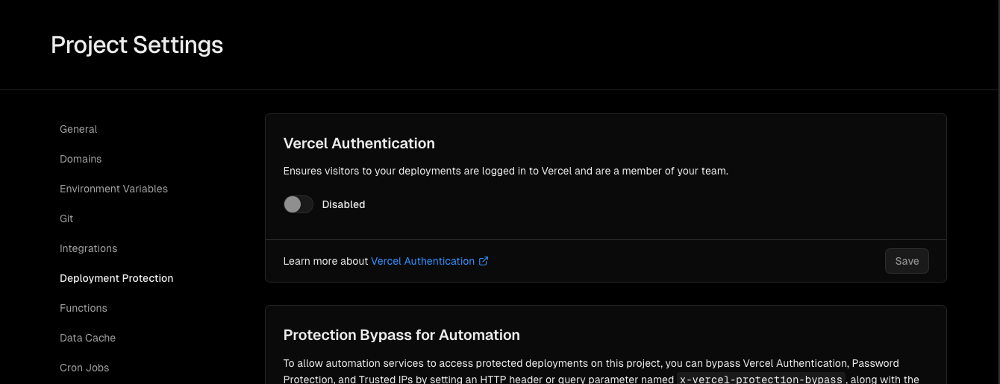

# Compare Sitemaps

## Deployment

GCP command

Please add `--set-env-vars GITHUB_TOKEN=your-github-token` at the end of the following command.


```
gcloud functions deploy compareSitemaps \
  --runtime python38 \
  --trigger-http \
  --allow-unauthenticated \
  --entry-point compare_sitemaps \
```

## Set up

### Vercel
- Turn off "Vercel Authentication" in Deployment Protection to allow the endpoint to access preview pages
